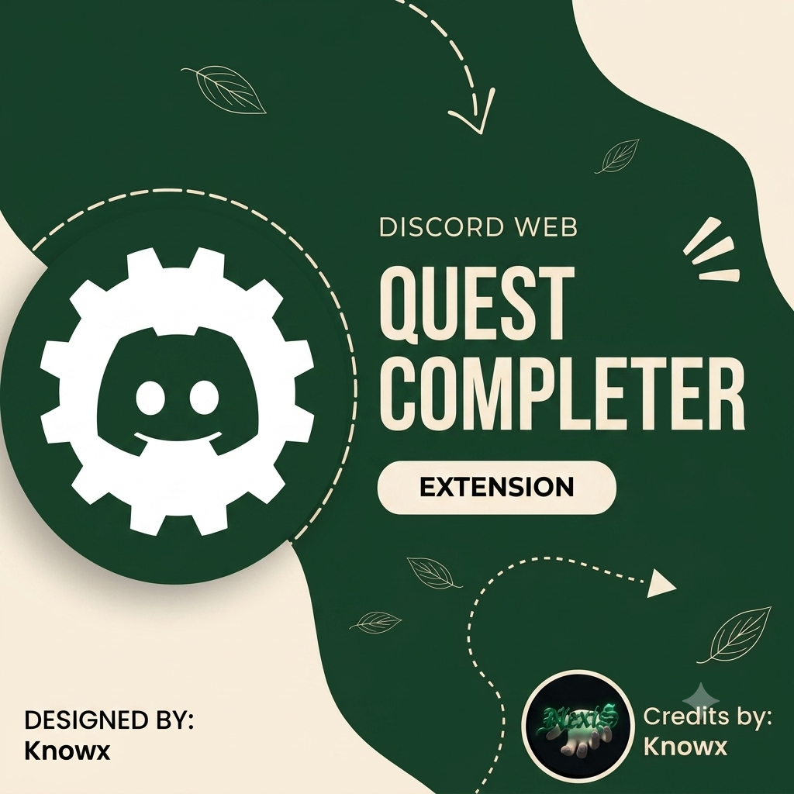

<!-- Yeh code upar tera bada dark green poster center mein lagayega -->

  

# Discord Web Quest Completer Extension

<!-- Yeh code tere icon ko right side mein set karega aur text left mein aayega -->

Extension that automatically completes Discord quests. No more manually watching videos or playing massive games - just click a button and let it run quests one by one automatically. Works directly from your browser!
Developed and Designed by **Knowx** ☘️

> [!NOTE]  
> **Disclaimer:** This extension is for educational purposes. Automating user accounts violates Discord's ToS. Use at your own risk.
  
Original Source from aamiaa 🌸
  
### ✨ Features
* **🚀 Zero Downloads Needed:** Spoofs the game presence so you don't have to install heavy files.
* **⚡ Lightweight & Fast:** Runs efficiently in your browser without eating up RAM.
* **🖱️ One-Click Automation:** Simple UI to start and track quests.

### 🛠️ How to Install
1. Click on the green **"<> Code"** button at the top right.
2. Select **"Download ZIP"** and extract the file.
3. Open `chrome://extensions/` in your browser.
4. Enable **"Developer mode"**.
5. Click **"Load unpacked"** and select the extracted folder.
